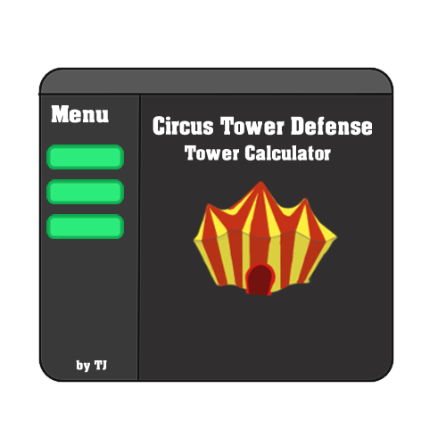
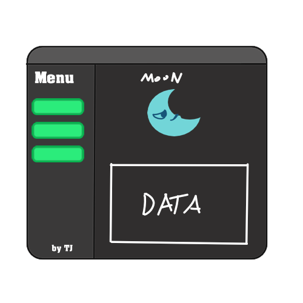

# Circus-Tower-Calculator
 HI! I'm studying Python, and here i'm making a Circus Tower Defense(from Roblox) tower calculator! 

## Using
 It'll use customtkinter for the interface, the focus is for making something like this:

